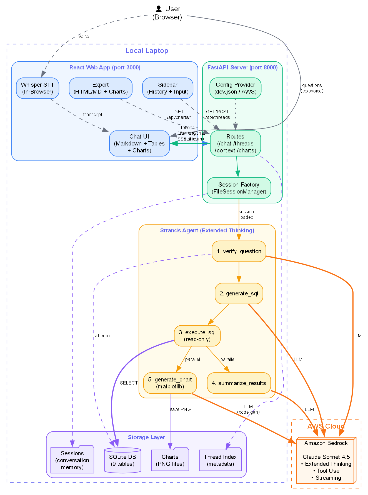

# NLP-to-SQL — AI Data Assistant

An AI-powered conversational interface that lets users query databases using natural language. Ask questions in plain English, get SQL queries, tabular results, charts, and intelligent insights — all through a modern chat UI.

## What It Does

This project is a **database-agnostic** AI assistant. While this v1 ships with a demo e-commerce SQLite database, it works with **any SQLite database** you point it to. Simply replace the database file path in the config and the system automatically:

- Reads the schema dynamically (tables, columns, relationships)
- Generates 6 relevant sample questions based on YOUR schema using the LLM
- Answers any natural language question about YOUR data

**Core capabilities:**
- **Natural language to SQL**: Ask questions like "Which customers spent the most last quarter?" — the agent verifies the question is answerable, generates SQL, executes it, and returns results with analysis
- **Automated chart generation**: Produces matplotlib visualizations alongside every query result
- **Conversation memory**: Multi-turn conversations where the agent remembers context within a session
- **Intelligent summaries**: Highlights trends, outliers, and suggests follow-up questions
- **Voice input**: Speak your questions using in-browser Whisper speech-to-text (no server needed)
- **Export**: Download responses or full conversations as HTML or Markdown with embedded charts

### Connecting Your Own Database

1. Place your SQLite `.db` file anywhere on your machine
2. Update `agent/utils/config_files/dev.json` — no code changes needed, OR update the `DB_PATH` in the config
3. Restart the server — the agent reads the schema at startup and adapts automatically

The welcome screen will show 6 LLM-generated sample questions based on your schema, and the agent will query your tables.

## Architecture



```
React (Vite + TypeScript)  ←→  FastAPI (SSE streaming)  ←→  Strands Agent  ←→  AWS Bedrock (Claude Sonnet 4.5)
                                                                    ↓
                                                              SQLite Database
```

- **Frontend**: React chat interface with dark/light mode, glassmorphism sidebar, resizable panels, streaming responses with markdown/table/chart rendering
- **Backend**: FastAPI server with Server-Sent Events for real-time token streaming
- **Agent**: Strands Agents SDK with 5 tools (verify, generate SQL, execute, summarize, chart), extended thinking, and session-based memory
- **Database**: SQLite e-commerce demo (9 tables: users, orders, products, shipping, reviews, etc.)
- **Storage**: Pluggable interfaces for sessions (FileSessionManager → AgentCore Memory), threads (JSON → DynamoDB), charts (local → S3 + CloudFront)

## Key Features

| Feature | Implementation |
|---------|---------------|
| Streaming responses | SSE with thinking/tool/metrics events |
| Extended thinking | Claude 4.5 with 4096 token reasoning budget |
| Session memory | Strands FileSessionManager (AgentCore-ready) |
| Chart generation | LLM generates matplotlib code, executed via subprocess |
| Voice input | Whisper tiny.en running in browser via WebGPU/WASM |
| Multi-thread chat | UUID4 session IDs, thread history with LLM-generated titles |
| Export | HTML (with embedded base64 charts) and Markdown |
| Dark/light mode | CSS variables with theme toggle |
| Config management | JSON config files (dev) → AWS AppConfig (prod) |
| TTL cleanup | Auto-deletes old sessions, threads, and charts |

## Prerequisites

Before running this project, you need the following set up on your machine:

### 1. Python 3.11+
- Download from [python.org](https://www.python.org/downloads/) or install via your package manager
- Verify: `python --version`

### 2. uv (Python package manager)
- Install: `pip install uv` or via [installation guide](https://docs.astral.sh/uv/getting-started/installation/)
- Verify: `uv --version`

### 3. Node.js 20+ and npm
- Download from [nodejs.org](https://nodejs.org/) (LTS version recommended)
- Verify: `node --version` and `npm --version`

### 4. AWS Account with Bedrock Access

This is the most important prerequisite — the AI agent uses Amazon Bedrock to access Claude Sonnet 4.5.

**Step-by-step:**

1. **Create an AWS Account** (if you don't have one): [aws.amazon.com](https://aws.amazon.com/)

2. **Enable Claude Sonnet 4.5 in Amazon Bedrock**:
   - Go to the [AWS Console](https://console.aws.amazon.com/)
   - Navigate to **Amazon Bedrock** → **Model access** (in the left menu)
   - Click **Manage model access**
   - Check **Anthropic → Claude Sonnet 4.5** (model ID: `us.anthropic.claude-sonnet-4-5-20250929-v1:0`)
   - Click **Save changes** and wait for access to be granted (usually instant)

3. **Create an IAM User with Bedrock permissions**:
   - Go to **IAM** → **Users** → **Create user**
   - Attach the policy: `AmazonBedrockFullAccess` (or a custom policy with `bedrock:InvokeModel` and `bedrock:InvokeModelWithResponseStream`)
   - Create an **Access Key** (Security credentials → Create access key → CLI use case)
   - Save the **Access Key ID** and **Secret Access Key**

4. **Install and configure AWS CLI**:
   ```bash
   # Install AWS CLI v2: https://docs.aws.amazon.com/cli/latest/userguide/getting-started-install.html
   
   # Configure with your credentials:
   aws configure
   ```
   Enter:
   - AWS Access Key ID: `<your key>`
   - AWS Secret Access Key: `<your secret>`
   - Default region: `us-east-1` (or any region where Bedrock + Claude is available)
   - Default output format: `json`

5. **Verify Bedrock access**:
   ```bash
   aws bedrock list-foundation-models --query "modelSummaries[?contains(modelId, 'claude')]" --output table
   ```
   You should see Claude models listed.

### 5. (Optional) Graphviz — for regenerating the architecture diagram
- Download from [graphviz.org](https://graphviz.org/download/)
- Only needed if you want to regenerate `docs/architecture.png`

---

## Quick Start

```bash
# 1. Clone the repo
git clone https://github.com/asmib170/NLPtoSQL.git
cd NLPtoSQL

# 2. Create virtual environment and install Python dependencies
uv venv
uv pip install -r requirements.txt

# 3. Install frontend dependencies
cd webui && npm install && cd ..

# 4. Create and populate the demo database
python prereq/01_create_db.py
python prereq/02_populate_db.py

# 5. Run everything (or just double-click start.bat on Windows)
start.bat
```

This starts:
- **Backend** on `http://localhost:8000` (FastAPI + Strands Agent)
- **Frontend** on `http://localhost:3000` (React chat UI)
- Opens your browser automatically

### Using Your Own Database

To point the agent at a different SQLite database:
1. Edit `agent/utils/config_files/dev.json`
2. The `DB_PATH` is automatically resolved from the project root — or set it as an absolute path
3. Restart the backend — the agent reads the new schema and generates appropriate sample questions

Opens at [http://localhost:3000](http://localhost:3000) with backend on port 8000.

## Project Structure

```
NLPtoSQL/
├── agent/                   # Python backend
│   ├── server.py            # FastAPI entry point
│   ├── nlp_sql_agent.py     # Agent model + system prompt
│   ├── tools/               # Agent tools (SQL, chart, DB inspector)
│   ├── routes/              # API endpoints (chat, threads, context, charts)
│   ├── storage/             # Persistence interfaces (threads, charts)
│   ├── utils/               # Config, LLM utils, session factory, cleanup
│   └── data/                # Runtime data (sessions, threads, charts)
├── webui/                   # React frontend
│   ├── src/components/      # UI components (ChatWindow, MessageBubble, etc.)
│   ├── src/hooks/           # State management (useThreads, useSpeechToText)
│   ├── src/api/             # Backend service layer
│   └── src/utils/           # Export utilities
├── prereq/                  # Database setup scripts
├── docs/                    # Architecture diagrams and documentation
└── start.bat               # One-click launcher
```

## Production Migration (AWS AgentCore)

The codebase is designed for a clean migration to AWS:

| Component | Local (Dev) | AWS (Prod) |
|-----------|-------------|------------|
| Server | FastAPI (localhost:8000) | AgentCore Runtime |
| Memory | FileSessionManager | AgentCoreMemorySessionManager |
| Chat history | JSON files | DynamoDB |
| Charts | Local filesystem | S3 + CloudFront |
| Config | config/dev.json | AWS AppConfig |
| Frontend | Vite dev server | S3 + CloudFront |

Migration steps:
1. Set `APP_ENV=prod` and `SESSION_BACKEND=agentcore`
2. Uncomment AWS implementations in storage and session factory
3. Deploy agent to AgentCore Runtime
4. Build and deploy frontend to S3

## Tech Stack

- **Agent**: Strands Agents SDK, Amazon Bedrock (Claude Sonnet 4.5)
- **Backend**: Python, FastAPI, SQLite, boto3
- **Frontend**: React 18, TypeScript, Vite, react-markdown, Whisper.js
- **Tools**: matplotlib (charts), graphviz (architecture diagrams)
